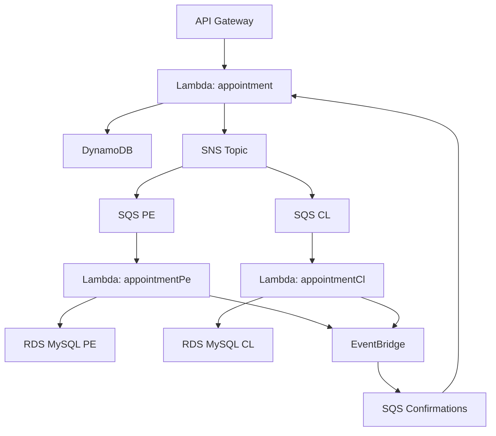

# Serverless Appointment Service

Servicio serverless para agendamiento de citas médicas para asegurados que opera tanto en Perú como Chile, construido con AWS Lambda, DynamoDB, SNS, SQS, EventBridge y RDS.

## Author:

Adriana Balceda

## Descripción

Este servicio backend permite a los asegurados agendar citas médicas mediante una API REST. El sistema procesa las solicitudes de forma asíncrona, utilizando diferentes flujos de procesamiento según el país (Perú o Chile) y mantiene el estado de las citas en tiempo real.

### Flujo de Negocio

1. El asegurado envía una solicitud de agendamiento
2. El sistema guarda la cita con estado "pending"
3. La solicitud se procesa según el país correspondiente
4. Se registra en la base de datos del país específico
5. Se confirma el agendamiento y actualiza el estado a "completed"

## Arquitectura

### Flujo de Procesamiento



## Componentes Principales

- **API Gateway**: Punto de entrada REST para las peticiones
- **Lambda Functions**: Procesamiento serverless de la lógica de negocio
- **DynamoDB**: Almacenamiento de estados de citas
- **SNS/SQS**: Comunicación asíncrona entre servicios
- **EventBridge**: Manejo de eventos de confirmación
- **RDS MySQL**: Almacenamiento persistente por país

## Tecnologías

- **Runtime**: Node.js 18.x
- **Language**: TypeScript
- **Framework**: Serverless Framework v4
- **Cloud Provider**: AWS
- **Databases**:
  - DynamoDB (estados de citas)
  - MySQL/RDS (datos por país)
- **Arquitectura**: Clean Architecture + SOLID Principles
- **Testing**: Jest
- **Documentación**: Swagger/OpenAPI

## Requisitos

- Node.js >= 18.x
- npm >= 8.x
- AWS CLI configurado
- Serverless Framework CLI
- Acceso a AWS con permisos para Lambda, DynamoDB, SNS, SQS, EventBridge

## Instalación

```bash
# Clonar el repositorio
git clone https://github.com/Adribalcd/serverless-appointment-service.git
cd serverless-appointment-service

# Instalar dependencias
npm install

# Configurar variables de entorno
cp .env.example .env
# Editar .env con tus configuraciones

# Compilar TypeScript
npm run build
```

# Configuracion

## Variables de Entorno

# DynamoDB

APPOINTMENT_TABLE=appointment-service-appointments-dev

# SNS

SNS_TOPIC_ARN=arn:aws:sns:us-east-1:123456789:appointment-events

# EventBridge

EVENT_BUS_NAME=default
EVENT_SOURCE=custom.appointment

# MySQL Peru

MYSQL_PE_HOST=appointments-pe.region.rds.amazonaws.com
MYSQL_PE_PORT=3306
MYSQL_PE_DB=appointments_pe
MYSQL_PE_USER=admin
MYSQL_PE_PASSWORD=your_password

# MySQL Chile

MYSQL_CL_HOST=appointments-cl.region.rds.amazonaws.com
MYSQL_CL_PORT=3306
MYSQL_CL_DB=appointments_cl
MYSQL_CL_USER=admin
MYSQL_CL_PASSWORD=your_password

# DynamoDB Schema

```bash
{
  "appointmentId": "string",
  "insuredId": "string",
  "scheduleId": "number",
  "countryISO": "string",
  "status": "pending|completed",
  "createdAt": "string",
  "updatedAt": "string"
}
```

# MySQL Schema (PE/CL)

```bash
CREATE TABLE appointments (
  id INT AUTO_INCREMENT PRIMARY KEY,
  appointment_id VARCHAR(255) UNIQUE,
  insured_id VARCHAR(5),
  schedule_id INT,
  created_at TIMESTAMP DEFAULT CURRENT_TIMESTAMP
);
```

# Serverless Appointment Service

Servicio de citas médicas construido con Serverless Framework v4, TypeScript y AWS.

## Despliegue

Este proyecto usa **Serverless Framework v4** para el despliegue en AWS.  
Asegúrate de tener configuradas tus credenciales de AWS antes de iniciar.

### Requisitos Previos

- **Node.js** >= 18.x
- **Serverless Framework CLI** instalado globalmente:
  ```bash
  npm install -g serverless
  ```
- **AWS CLI** instalado y configurado:
  ```bash
  aws configure
  ```
  > Agrega tu `AWS_ACCESS_KEY_ID` y `AWS_SECRET_ACCESS_KEY` con permisos para Lambda, DynamoDB, SNS, SQS y EventBridge

### Preparar el Proyecto

1. **Clona el repositorio** y entra en el directorio:

   ```bash
   git clone https://github.com/Adribalcd/serverless-appointment-service.git
   cd serverless-appointment-service
   ```

2. **Instala dependencias**:

   ```bash
   npm install
   ```

3. **Compila el código TypeScript**:

   ```bash
   npm run build
   ```

4. **Configura las variables de entorno** (ejemplo en `.env.example`):
   ```bash
   cp .env.example .env
   ```
   > Edita `.env` con tus valores (ARNs, credenciales RDS, etc.)

## Desarrollo Local

Para probar la API en local con `serverless-offline`:

```bash
npm run start:offline
```

Esto levanta un servidor en `http://localhost:3000/dev`

### Endpoints Disponibles

- `POST /appointments` - Crear nueva cita
- `GET /appointments-insured` - Obtener citas por asegurado
- `GET /docs` - Swagger UI interactivo

## Despliegue en AWS

### Despliegue a Desarrollo (dev):

```bash
npm run deploy:dev
```

### Despliegue a Producción (prod):

```bash
npm run deploy:prod
```

## Recursos Creados en AWS

El despliegue crea automáticamente:

- **5 Lambda Functions**
- **1 DynamoDB Table** con índice secundario global (GSI)
- **1 SNS Topic** para eventos
- **3 SQS Queues** (PE, CL, Confirmaciones)
- **1 EventBridge Rule** para confirmaciones
- **API Gateway REST API**
- **IAM Roles y Policies** mínimas necesarias

## Flujo de CI/CD

GitHub Actions configurado (`.github/workflows/ci.yml`), cada push desplega automáticamente:

- `dev` -> Ambiente de desarrollo
- `main` -> Ambiente de producción

## Verificación del Despliegue

Una vez desplegado, Serverless CLI mostrará las URLs generadas:

**Ejemplo:**

```bash
Service Information
endpoint: https://<api-id>.execute-api.us-east-1.amazonaws.com/dev
functions:
  createAppointment: serverless-appointment-service-dev-createAppointment
  getAppointments: serverless-appointment-service-dev-getAppointments
  swaggerDocs: serverless-appointment-service-dev-swaggerDocs
```

**Prueba en el navegador o con curl:**

```bash
curl https://<api-id>.execute-api.us-east-1.amazonaws.com/dev/appointments
```

## Buenas Prácticas

- Usa `npm run lint` y `npm run format` antes de hacer commits
- Los commits deben seguir [Conventional Commits](https://www.conventionalcommits.org/)
- Mantén las credenciales y variables sensibles fuera del repo (usa `.env`)

## 🛠️ Scripts Disponibles

```bash
# Desarrollo
npm run start:offline    # Ejecutar en local con serverless-offline
npm run build           # Compilar TypeScript
npm run dev            # Modo desarrollo con hot-reload

# Despliegue
npm run deploy:dev     # Desplegar a desarrollo
npm run deploy:prod    # Desplegar a producción

# Calidad de código
npm run lint          # Ejecutar ESLint
npm run lint:fix      # Corregir errores de ESLint automáticamente
npm run format        # Formatear código con Prettier
npm run test          # Ejecutar tests
npm run test:watch    # Ejecutar tests en modo watch

# Utilidades
npm run remove:dev    # Eliminar stack de desarrollo
npm run remove:prod   # Eliminar stack de producción
npm run logs:dev      # Ver logs de desarrollo
npm run logs:prod     # Ver logs de producción
```

## Estructura del Proyecto

```
serverless-appointment-service/
├── src/
│   ├── handlers/          # Lambda functions
│   ├── services/          # Lógica de negocio
│   ├── models/            # Tipos y interfaces
│   ├── utils/             # Utilidades
│   └── config/            # Configuración
├── docs/                  # Documentación Swagger
├── tests/                 # Tests unitarios
├── .env.example          # Variables de entorno ejemplo
├── serverless.yml        # Configuración Serverless
├── tsconfig.json         # Configuración TypeScript
└── package.json          # Dependencias y scripts
```

## Variables de Entorno

Crea un archivo `.env` basado en `.env.example`:

```env
# AWS Configuration
AWS_REGION=us-east-1
STAGE=dev

# Database
APPOINTMENTS_TABLE_NAME=appointments-table-dev
APPOINTMENTS_GSI_NAME=insured-appointments-index

# SNS
SNS_TOPIC_ARN=arn:aws:sns:us-east-1:123456789012:appointments-topic-dev

# SQS
SQS_QUEUE_PE_URL=https://sqs.us-east-1.amazonaws.com/123456789012/appointments-pe-queue-dev
SQS_QUEUE_CL_URL=https://sqs.us-east-1.amazonaws.com/123456789012/appointments-cl-queue-dev
SQS_CONFIRMATION_QUEUE_URL=https://sqs.us-east-1.amazonaws.com/123456789012/confirmations-queue-dev

# External Services
RDS_HOST=your-rds-endpoint.amazonaws.com
RDS_USERNAME=your-username
RDS_PASSWORD=your-password
RDS_DATABASE=your-database
```

## Troubleshooting

### Error: "Cannot resolve serverless.yml"

```bash
# Asegúrate de estar en el directorio correcto
pwd
ls -la serverless.yml
```

### Error: "AWS credentials not found"

```bash
# Configura AWS CLI
aws configure
# O exporta las variables
export AWS_ACCESS_KEY_ID=your-key
export AWS_SECRET_ACCESS_KEY=your-secret
```

### Error: "Module not found"

```bash
# Reinstala dependencias
rm -rf node_modules package-lock.json
npm install
```

# Algunos Patrones de Diseño Implementados

## Patrones Arquitectónicos

### Event-Driven Architecture

- **Implementación**: SNS + SQS + EventBridge
- **Ubicación**: `serverless.yml` (líneas 126-241)
- **Descripción**: Procesamiento asíncrono de citas mediante eventos

### Microservices Pattern

- **Implementación**: Funciones Lambda independientes
- **Ubicación**: `serverless.yml` (líneas 45-101)
- **Descripción**: Servicios separados para creación, consulta y procesamiento

## Patrones de Control de Flujo

### Fan-Out/Fan-In

- **Implementación**: SNS -> múltiples colas SQS
- **Ubicación**: `serverless.yml` (líneas 184-199)
- **Descripción**: Distribución de eventos a procesadores por país

## Patrones de Integración

### Message Queue Pattern

- **Implementación**: SQS queues por país
- **Ubicación**: `serverless.yml` (líneas 133-142)
- **Descripción**: Colas dedicadas para PE y CL

### API Gateway Pattern

- **Implementación**: AWS API Gateway
- **Ubicación**: `docs/swagger.yml`
- **Descripción**: Punto de entrada único para operaciones REST

### Database per Service

- **Implementación**: MySQL separado por país
- **Ubicación**: `serverless.yml` (líneas 64-82)
- **Descripción**: Base de datos independiente para PE y CL

## Patrones de Implementacion

### Strategy Pattern

- **Implementación**: Múltiples estrategias intercambiables
- **Ubicaciones**:
  - `src/infra/ValidationService.ts` - Estrategias de validación
  - `src/infra/services/SNSNotificationService.ts` - Estrategias de notificación
  - `src/infra/repositories/` - Estrategias de persistencia (DynamoDB/MySQL)
  - `src/infra/events/EventBridgePublisher.ts` - Estrategia de eventos
- **Descripción**: Algoritmos intercambiables para validación, notificación y persistencia

## Patrones de Datos

### DTO

- **Implementación**: Objetos especializados para transferencia de datos
- **Ubicaciones**:
  - `src/domain/Appointment.ts` - DTOs del dominio
  - `src/infra/types/LambdaTypes.ts` - DTOs de infraestructura
  - `docs/swagger.yml` - DTOs de API
- **Descripción**: Encapsula datos para transferencia entre capas y servicios
- **Ejemplos**: `AppointmentRequest`, `AppointmentSQSMessage`, `SNSMessageWrapper`
